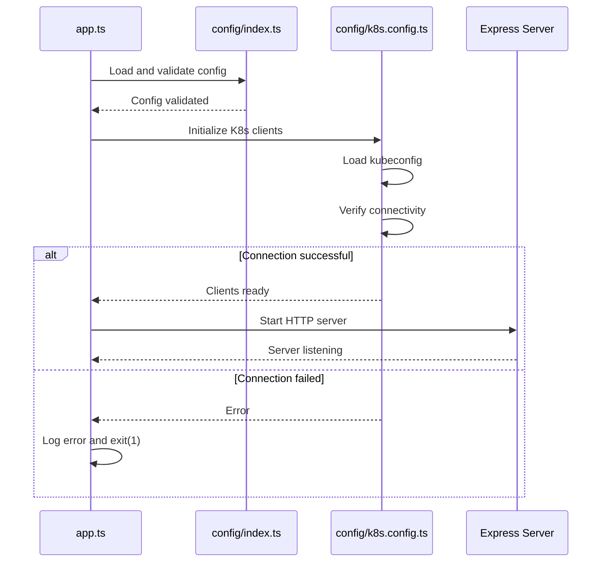
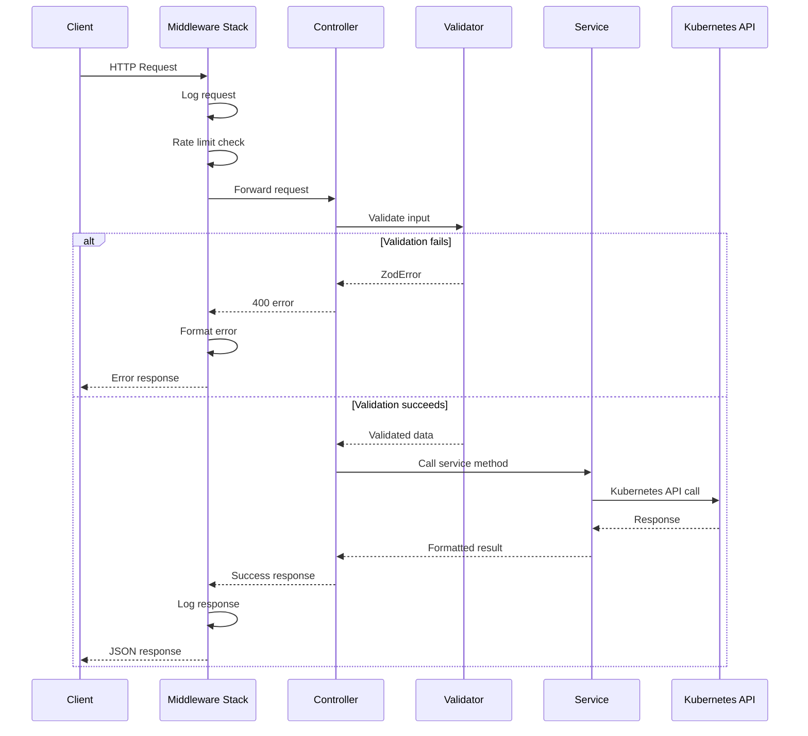
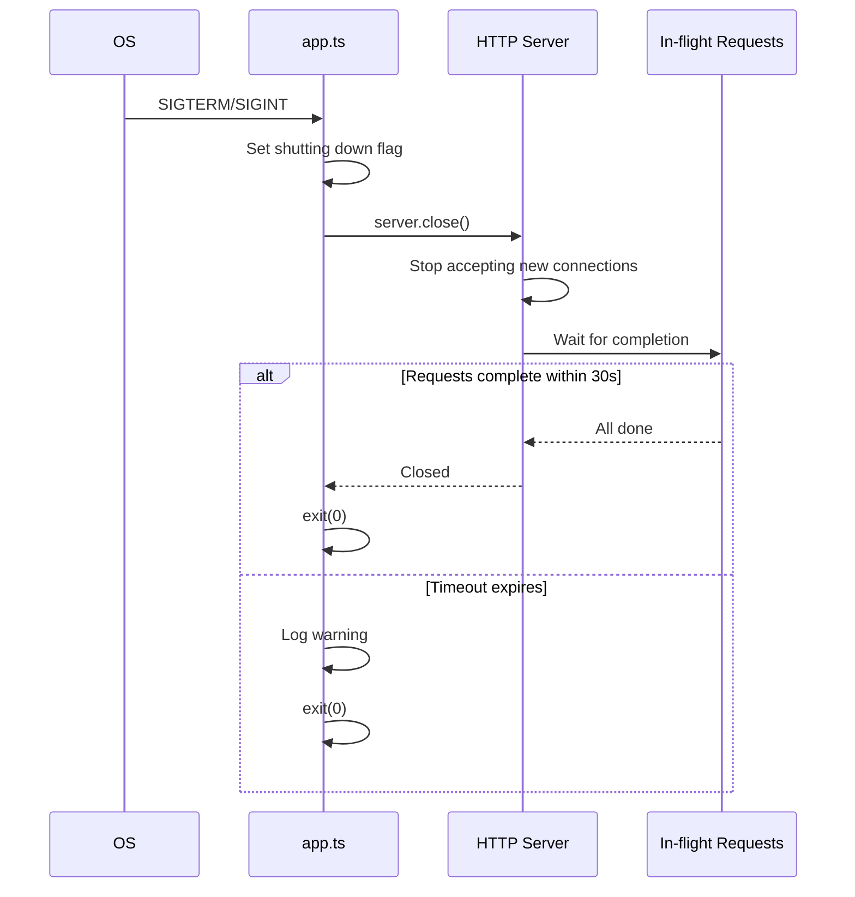

# Design Document: K3s API Bug Fixes and Improvements

## Overview

This design addresses critical bugs and implements essential improvements for the K3s Backend API. The focus is on reliability, security, observability, and maintainability while preserving the existing architecture and API contracts.

The design follows a layered architecture pattern:
- **Configuration Layer**: Centralized configuration with validation
- **Middleware Layer**: Cross-cutting concerns (logging, rate limiting, CORS, security headers, error handling)
- **Controller Layer**: HTTP request handling and response formatting
- **Service Layer**: Business logic and Kubernetes API interactions
- **Validation Layer**: Input validation using Zod schemas

Key improvements include:
1. Startup validation to fail fast on configuration issues
2. Enhanced health checks with Kubernetes connectivity verification
3. Comprehensive error handling with proper ZodError formatting
4. Complete input validation across all endpoints
5. Graceful shutdown handling for zero-downtime deployments
6. Security hardening (rate limiting, CORS, helmet, input sanitization)
7. Observability (structured logging, Prometheus metrics)
8. Comprehensive testing strategy

## Architecture

### System Initialization Flow



### Request Processing Flow



### Graceful Shutdown Flow



## Components and Interfaces

### 1. Configuration Module (`src/config/index.ts`)

**Purpose**: Centralize all configuration values and validate environment variables on startup.

**Interface**:
```typescript
export interface AppConfig {
  // Server configuration
  port: number;
  nodeEnv: 'development' | 'production' | 'test';
  
  // Kubernetes configuration
  defaultNamespace: string;
  k8sTimeout: number; // milliseconds
  
  // Rate limiting
  rateLimitWindowMs: number;
  rateLimitMaxRequests: number;
  
  // CORS
  corsOrigins: string[];
  
  // Logging
  logLevel: 'debug' | 'info' | 'warn' | 'error';
  logFormat: 'json' | 'text';
  
  // Shutdown
  shutdownTimeoutMs: number;
  
  // Pagination
  defaultPageSize: number;
  maxPageSize: number;
}

export function loadConfig(): AppConfig;
export function validateConfig(config: Partial<AppConfig>): AppConfig;
```

**Implementation Details**:
- Use Zod schema to validate environment variables
- Provide sensible defaults for optional values
- Throw descriptive errors for missing required variables
- Export a singleton `config` object

### 2. Enhanced Kubernetes Configuration (`src/config/k8s.config.ts`)

**Purpose**: Initialize Kubernetes clients with connection verification.

**Interface**:
```typescript
export interface K8sClients {
  coreV1Api: k8s.CoreV1Api;
  appsV1Api: k8s.AppsV1Api;
  networkingV1Api: k8s.NetworkingV1Api;
  kc: k8s.KubeConfig;
}

export async function initializeK8sClients(): Promise<K8sClients>;
export async function verifyK8sConnectivity(client: k8s.CoreV1Api): Promise<void>;
export async function checkK8sHealth(client: k8s.CoreV1Api): Promise<boolean>;
```

**Implementation Details**:
- `initializeK8sClients()`: Load kubeconfig, create clients, verify connectivity
- `verifyK8sConnectivity()`: Make a lightweight API call (list namespaces with limit=1) with timeout
- `checkK8sHealth()`: Used by health endpoint, returns boolean without throwing
- Throw descriptive errors on connection failure

### 3. Request Logging Middleware (`src/middleware/logging.middleware.ts`)

**Purpose**: Log all HTTP requests and responses with correlation IDs.

**Interface**:
```typescript
export interface RequestLog {
  requestId: string;
  method: string;
  path: string;
  query: Record<string, unknown>;
  ip: string;
  userAgent: string;
  timestamp: string;
}

export interface ResponseLog extends RequestLog {
  statusCode: number;
  duration: number;
  error?: string;
}

export function loggingMiddleware(
  req: Request,
  res: Response,
  next: NextFunction
): void;
```

**Implementation Details**:
- Generate UUID for each request and attach to `req.id`
- Log request details on entry
- Intercept response to log status code and duration
- Use structured JSON logging
- Include request ID in all subsequent logs

### 4. Rate Limiting Middleware (`src/middleware/rateLimit.middleware.ts`)

**Purpose**: Protect API from abuse using rate limiting.

**Interface**:
```typescript
export function createRateLimiter(options: {
  windowMs: number;
  max: number;
  skipPaths?: string[];
}): RequestHandler;
```

**Implementation Details**:
- Use `express-rate-limit` library
- Store rate limit data in memory (suitable for single-instance deployment)
- Skip health endpoint and metrics endpoint
- Return 429 with Retry-After header
- Include rate limit headers in all responses (X-RateLimit-Limit, X-RateLimit-Remaining)

### 5. Enhanced Error Middleware (`src/middleware/error.middleware.ts`)

**Purpose**: Handle all errors with proper formatting, especially ZodError.

**Interface**:
```typescript
export interface ErrorResponse {
  success: false;
  error: string;
  details?: unknown;
  requestId?: string;
}

export function errorMiddleware(
  err: Error,
  req: Request,
  res: Response,
  next: NextFunction
): void;
```

**Implementation Details**:
- Check if error is ZodError using `err instanceof ZodError`
- For ZodError: extract `err.issues` array and format as structured validation errors
- For Kubernetes errors: preserve existing handling
- For generic errors: return status code and message
- Always include request ID in error responses
- Log full error stack trace for debugging

**ZodError Formatting**:
```typescript
{
  success: false,
  error: "Validation error",
  details: [
    {
      field: "name",
      message: "Pod name is required"
    },
    {
      field: "image",
      message: "Container image is required"
    }
  ],
  requestId: "uuid"
}
```

### 6. Namespace Validator (`src/validators/namespace.validator.ts`)

**Purpose**: Validate namespace creation and update requests.

**Interface**:
```typescript
export const createNamespaceSchema: z.ZodSchema;
export type CreateNamespaceInput = z.infer<typeof createNamespaceSchema>;
```

**Schema Definition**:
```typescript
{
  name: string (required, 1-253 chars, lowercase alphanumeric with hyphens),
  labels: Record<string, string> (optional)
}
```

### 7. Enhanced Health Check (`src/routes/health.ts`)

**Purpose**: Provide comprehensive health status including Kubernetes connectivity.

**Interface**:
```typescript
export interface HealthResponse {
  status: 'healthy' | 'unhealthy';
  timestamp: string;
  checks: {
    server: 'ok';
    kubernetes: 'ok' | 'error';
  };
  error?: string;
}
```

**Implementation Details**:
- Always return server status as 'ok' (if code is running)
- Call `checkK8sHealth()` with 5-second timeout
- Return 200 if both checks pass
- Return 503 if Kubernetes check fails
- Include error message in response when unhealthy

### 8. Graceful Shutdown Handler (`src/utils/shutdown.ts`)

**Purpose**: Handle SIGTERM/SIGINT signals and gracefully shut down the server.

**Interface**:
```typescript
export function setupGracefulShutdown(
  server: http.Server,
  options: {
    timeout: number;
    onShutdown?: () => Promise<void>;
  }
): void;
```

**Implementation Details**:
- Register handlers for SIGTERM and SIGINT
- On signal: log shutdown initiation
- Call `server.close()` to stop accepting new connections
- Wait for in-flight requests with timeout
- Call optional cleanup callback (e.g., close database connections)
- Exit with code 0 on success

### 9. Pagination Utility (`src/utils/pagination.ts`)

**Purpose**: Provide consistent pagination across list endpoints.

**Interface**:
```typescript
export interface PaginationParams {
  limit?: number;
  continue?: string;
}

export interface PaginatedResponse<T> {
  items: T[];
  metadata: {
    continue?: string;
    remainingItemCount?: number;
  };
}

export function parsePaginationParams(query: unknown): PaginationParams;
export function applyPagination<T>(
  items: T[],
  params: PaginationParams,
  maxPageSize: number
): PaginatedResponse<T>;
```

**Implementation Details**:
- Parse and validate limit parameter (default: 100, max: configurable)
- Parse continue token (base64-encoded offset)
- Slice items array based on pagination params
- Generate continue token if more items available
- Return paginated response with metadata

### 10. Metrics Module (`src/middleware/metrics.middleware.ts`)

**Purpose**: Collect and expose Prometheus metrics.

**Interface**:
```typescript
export function metricsMiddleware(
  req: Request,
  res: Response,
  next: NextFunction
): void;

export function getMetricsHandler(
  req: Request,
  res: Response
): void;
```

**Metrics Collected**:
- `http_requests_total`: Counter of HTTP requests by method, path, status
- `http_request_duration_seconds`: Histogram of request duration
- `k8s_api_calls_total`: Counter of Kubernetes API calls by operation
- `k8s_api_call_duration_seconds`: Histogram of K8s API call duration
- `active_connections`: Gauge of current active connections
- `errors_total`: Counter of errors by type

**Implementation Details**:
- Use `prom-client` library
- Register default metrics (memory, CPU, etc.)
- Instrument HTTP requests in middleware
- Instrument K8s API calls in service layer
- Expose metrics at `/metrics` endpoint

### 11. Security Middleware (`src/middleware/security.middleware.ts`)

**Purpose**: Apply security headers and input sanitization.

**Interface**:
```typescript
export function securityMiddleware(): RequestHandler[];
```

**Implementation Details**:
- Use `helmet` middleware with appropriate configuration
- Disable X-Powered-By header
- Set Content-Security-Policy for API usage
- Configure CORS based on environment
- Add input sanitization for string fields (trim, normalize Unicode)

### 12. Enhanced Validators

**Purpose**: Add input sanitization and security checks to all validators.

**Enhancements**:
- Trim whitespace from all string inputs
- Normalize Unicode characters
- Reject control characters in labels and names
- Validate environment variables don't contain shell metacharacters
- Add maximum length constraints to prevent DoS

## Data Models

### Configuration Schema

```typescript
const configSchema = z.object({
  PORT: z.string().regex(/^\d+$/).transform(Number).default('3000'),
  NODE_ENV: z.enum(['development', 'production', 'test']).default('development'),
  DEFAULT_NAMESPACE: z.string().default('default'),
  K8S_TIMEOUT: z.string().regex(/^\d+$/).transform(Number).default('5000'),
  RATE_LIMIT_WINDOW_MS: z.string().regex(/^\d+$/).transform(Number).default('900000'),
  RATE_LIMIT_MAX_REQUESTS: z.string().regex(/^\d+$/).transform(Number).default('100'),
  CORS_ORIGINS: z.string().transform(s => s.split(',')).default('*'),
  LOG_LEVEL: z.enum(['debug', 'info', 'warn', 'error']).default('info'),
  LOG_FORMAT: z.enum(['json', 'text']).default('json'),
  SHUTDOWN_TIMEOUT_MS: z.string().regex(/^\d+$/).transform(Number).default('30000'),
  DEFAULT_PAGE_SIZE: z.string().regex(/^\d+$/).transform(Number).default('100'),
  MAX_PAGE_SIZE: z.string().regex(/^\d+$/).transform(Number).default('1000'),
});
```

### Namespace Validator Schema

```typescript
const createNamespaceSchema = z.object({
  name: z.string()
    .min(1, 'Namespace name is required')
    .max(253, 'Namespace name must be at most 253 characters')
    .regex(
      /^[a-z0-9]([-a-z0-9]*[a-z0-9])?$/,
      'Namespace name must be lowercase alphanumeric with hyphens'
    )
    .transform(s => s.trim()),
  labels: z.record(
    z.string().regex(/^[a-z0-9]([-a-z0-9]*[a-z0-9])?$/),
    z.string().max(63).regex(/^[a-z0-9]([-a-z0-9]*[a-z0-9])?$/)
  ).optional(),
});
```

### Enhanced Service Port Schema (with type-safe parsing)

```typescript
const servicePortSchema = z.object({
  name: z.string().optional(),
  port: z.number().int().min(1).max(65535),
  targetPort: z.union([
    z.number().int().min(1).max(65535),
    z.string().regex(/^\d+$/).transform(Number)
  ]),
  protocol: z.enum(['TCP', 'UDP']).default('TCP'),
});
```

### Pagination Query Schema

```typescript
const paginationQuerySchema = z.object({
  limit: z.string()
    .regex(/^\d+$/)
    .transform(Number)
    .refine(n => n > 0 && n <= 1000, 'Limit must be between 1 and 1000')
    .optional(),
  continue: z.string().optional(),
});
```

### Error Response Models

```typescript
interface ValidationErrorDetail {
  field: string;
  message: string;
  code?: string;
}

interface ErrorResponse {
  success: false;
  error: string;
  details?: ValidationErrorDetail[] | unknown;
  requestId?: string;
  timestamp: string;
}

interface HealthCheckError {
  status: 'unhealthy';
  timestamp: string;
  checks: {
    server: 'ok';
    kubernetes: 'error';
  };
  error: string;
}
```


## Correctness Properties

*A property is a characteristic or behavior that should hold true across all valid executions of a system—essentially, a formal statement about what the system should do. Properties serve as the bridge between human-readable specifications and machine-verifiable correctness guarantees.*

### Property Reflection

After analyzing all acceptance criteria, I identified several areas where properties can be consolidated:

1. **Error Middleware Properties (3.1-3.3)**: These three criteria all relate to ZodError handling and can be combined into a single comprehensive property about proper ZodError formatting.

2. **Logging Properties (7.1-7.5)**: These five criteria all relate to request/response logging and can be consolidated into fewer properties about logging completeness.

3. **Security Header Properties (10.2-10.4)**: These three criteria all relate to response headers and can be combined into a single property about required security headers.

4. **Metrics Properties (15.2-15.4)**: These three criteria all relate to metrics collection and can be consolidated into a single property about comprehensive metrics tracking.

5. **Input Sanitization Properties (16.1-16.3)**: These three criteria all relate to input validation and can be combined into a single property about input sanitization.

### Properties

**Property 1: Health Check Completeness**
*For any* health check request, the response SHALL include both server status and Kubernetes connectivity status, with appropriate HTTP status codes (200 for healthy, 503 for unhealthy).
**Validates: Requirements 2.1, 2.2, 2.3**

**Property 2: ZodError Formatting**
*For any* ZodError thrown during request processing, the error middleware SHALL return HTTP 400 with a structured response containing the error message "Validation error" and a details array where each element includes the field path and error message from the ZodError issues array.
**Validates: Requirements 3.1, 3.2, 3.3**

**Property 3: Namespace Validation**
*For any* namespace creation or update request, the validator SHALL verify that the name follows Kubernetes naming conventions (lowercase alphanumeric with hyphens, 1-253 characters) and that all required fields are present, returning a 400 error with detailed messages if validation fails.
**Validates: Requirements 4.1, 4.2, 4.3, 4.4**

**Property 4: Configuration Validation**
*For any* missing or invalid required environment variable, the application SHALL fail to start, log a descriptive error message, and exit with a non-zero status code.
**Validates: Requirements 6.2, 6.5**

**Property 5: Request Logging Completeness**
*For any* HTTP request, the logging middleware SHALL generate a unique request ID and log both the request (method, path, timestamp) and response (status code, duration) with the request ID included in both log entries.
**Validates: Requirements 7.1, 7.2, 7.3, 7.4**

**Property 6: Structured Logging Format**
*For any* log entry produced by the application, the output SHALL be valid JSON with consistent field names and structure.
**Validates: Requirements 7.5**

**Property 7: Rate Limit Headers**
*For any* HTTP 429 (Too Many Requests) response, the response SHALL include a Retry-After header indicating when requests can resume.
**Validates: Requirements 8.3**

**Property 8: CORS Method Support**
*For any* HTTP request using standard methods (GET, POST, PUT, DELETE, PATCH), the CORS middleware SHALL allow the request when the origin is in the allowed origins list.
**Validates: Requirements 9.4**

**Property 9: Security Headers Presence**
*For any* HTTP response, the response SHALL include the following security headers: Content-Security-Policy, X-Frame-Options, X-Content-Type-Options, and Strict-Transport-Security, and SHALL NOT include the X-Powered-By header.
**Validates: Requirements 10.2, 10.3, 10.4**

**Property 10: Type-Safe Port Parsing**
*For any* service port configuration where targetPort is provided as either a number or numeric string, the parser SHALL correctly convert it to a number type without throwing errors, and SHALL handle invalid values gracefully with appropriate error messages.
**Validates: Requirements 13.1**

**Property 11: Runtime Type Validation**
*For any* type assertion in the service layer, runtime validation SHALL be performed to verify the actual type matches the asserted type before proceeding with operations.
**Validates: Requirements 13.4**

**Property 12: Pagination Parameter Acceptance**
*For any* list endpoint request, the controller SHALL accept and parse optional 'limit' and 'continue' query parameters without errors.
**Validates: Requirements 14.1**

**Property 13: Pagination Limit Enforcement**
*For any* list endpoint request with a limit parameter, the response SHALL contain at most the specified number of items (or the configured maximum page size, whichever is smaller).
**Validates: Requirements 14.2**

**Property 14: Pagination Continuation**
*For any* list endpoint response where more results are available beyond the current page, the response metadata SHALL include a 'continue' token, and when that token is provided in a subsequent request, the next page of results SHALL be returned.
**Validates: Requirements 14.3, 14.4**

**Property 15: Metrics Collection Completeness**
*For any* HTTP request or Kubernetes API call, the metrics system SHALL update the appropriate counters and histograms tracking request count, duration, status codes, and error rates.
**Validates: Requirements 15.2, 15.3, 15.4**

**Property 16: Input Sanitization**
*For any* string input received by validators, the input SHALL be trimmed of whitespace and have Unicode characters normalized before validation rules are applied.
**Validates: Requirements 16.1**

**Property 17: Malicious Input Rejection**
*For any* label value or environment variable value containing control characters, special sequences, or shell metacharacters, the validator SHALL reject the input with a validation error and log a security warning.
**Validates: Requirements 16.2, 16.3, 16.5**

## Error Handling

### Error Categories

1. **Validation Errors (400)**
   - ZodError from input validation
   - Malformed request bodies
   - Invalid query parameters
   - Handled by error middleware with structured response

2. **Kubernetes API Errors (varies)**
   - 404: Resource not found
   - 409: Resource already exists
   - 403: Insufficient permissions
   - 500: Kubernetes API failures
   - Preserve existing error handling with body.message and body.reason

3. **Rate Limiting Errors (429)**
   - Handled by rate limit middleware
   - Include Retry-After header
   - Include rate limit information in response

4. **Internal Server Errors (500)**
   - Unexpected errors
   - Log full stack trace
   - Return generic error message to client
   - Include request ID for correlation

### Error Response Format

All errors follow a consistent format:

```typescript
{
  success: false,
  error: string,           // Human-readable error message
  details?: unknown,       // Additional error details (e.g., validation errors)
  requestId?: string,      // Request correlation ID
  timestamp: string        // ISO 8601 timestamp
}
```

### Error Logging

- All errors are logged with full stack traces
- Include request ID for correlation
- Include request method, path, and user IP
- Security-related errors (malicious input) logged at WARN level
- Unexpected errors logged at ERROR level

## Testing Strategy

### Dual Testing Approach

This project requires both unit tests and property-based tests for comprehensive coverage:

- **Unit tests**: Verify specific examples, edge cases, and error conditions
- **Property tests**: Verify universal properties across all inputs
- Both are complementary and necessary

### Unit Testing

Unit tests focus on:
- Specific examples that demonstrate correct behavior
- Edge cases (empty inputs, boundary values, special characters)
- Error conditions (missing config, connection failures, invalid input)
- Integration points between components
- Middleware behavior with specific request/response scenarios

**Key Unit Test Areas**:
1. Configuration loading with various environment variable combinations
2. Kubernetes connection verification with mocked clients
3. Health endpoint with healthy and unhealthy K8s states
4. Error middleware with different error types (ZodError, K8s errors, generic errors)
5. Graceful shutdown with various scenarios (clean shutdown, timeout, in-flight requests)
6. Rate limiting with requests below and above limits
7. CORS with different origins and methods
8. Pagination with various limit and continue values

### Property-Based Testing

Property tests focus on:
- Universal properties that hold for all inputs
- Comprehensive input coverage through randomization
- Invariants that must be maintained

**Configuration**:
- Minimum 100 iterations per property test
- Use appropriate property-based testing library (fast-check for TypeScript)
- Each test references its design document property
- Tag format: `Feature: k3s-api-bug-fixes-improvements, Property {number}: {property_text}`

**Key Property Test Areas**:
1. **Property 2**: ZodError formatting with randomly generated validation errors
2. **Property 3**: Namespace validation with randomly generated valid and invalid names
3. **Property 5**: Request logging with randomly generated requests
4. **Property 6**: Structured logging format validation with random log entries
5. **Property 10**: Type-safe port parsing with random port values (numbers and strings)
6. **Property 13**: Pagination limit enforcement with random limit values
7. **Property 14**: Pagination continuation with random result sets
8. **Property 16**: Input sanitization with random strings containing whitespace and Unicode
9. **Property 17**: Malicious input rejection with random control characters and metacharacters

### Test Organization

```
tests/
├── unit/
│   ├── config/
│   │   ├── index.test.ts
│   │   └── k8s.config.test.ts
│   ├── middleware/
│   │   ├── error.middleware.test.ts
│   │   ├── logging.middleware.test.ts
│   │   ├── rateLimit.middleware.test.ts
│   │   └── security.middleware.test.ts
│   ├── validators/
│   │   ├── namespace.validator.test.ts
│   │   ├── pod.validator.test.ts
│   │   ├── service.validator.test.ts
│   │   └── ingress.validator.test.ts
│   ├── services/
│   │   ├── namespace.service.test.ts
│   │   ├── pod.service.test.ts
│   │   ├── service.service.test.ts
│   │   └── ingress.service.test.ts
│   └── utils/
│       ├── pagination.test.ts
│       └── shutdown.test.ts
├── integration/
│   ├── health.test.ts
│   ├── namespaces.test.ts
│   ├── pods.test.ts
│   ├── services.test.ts
│   └── ingresses.test.ts
└── properties/
    ├── error-handling.property.test.ts
    ├── validation.property.test.ts
    ├── logging.property.test.ts
    ├── pagination.property.test.ts
    └── sanitization.property.test.ts
```

### Mocking Strategy

- Use `jest` or `vitest` for test framework
- Mock Kubernetes clients using `jest.mock()` or manual mocks
- Mock environment variables using `process.env` manipulation
- Mock HTTP requests/responses using `supertest` for integration tests
- Use `@kubernetes/client-node` mock implementations for service tests

### Coverage Goals

- Minimum 80% code coverage across all modules
- 100% coverage for validators and error handling
- Focus on critical paths: startup, error handling, validation, shutdown
